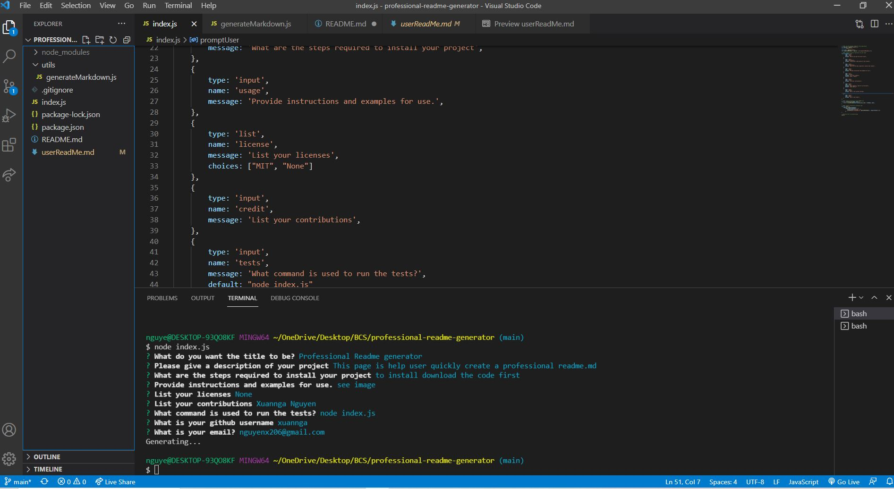

# professional-readme-generator

## Description
This project is to help user develop a high-quality README.md. By using command-line application that will generate a professional Readme.md file from a user's input.
This project has taught me how to use node, install npm (though I still have problems remembering what the commands are),and using inquirer prompt.

## Usage

- This tool will allow user to create a README.md
- Users will be asked to enter their Github username
- Users will be asked to enter their email
- Users need to provide the title of the project
- Users can describe the project
- Users will need to provide license if there's any
- Users will be asked if there's any contributors
- Users will be asked if there's a test to run
- Users need to provide the usage of the project
- Last but not least, list the contributors

## Link to github account
https://xuannga.github.io/professional-readme-generator/

### Walkthrough Video
https://drive.google.com/file/d/1_zS02Se5yrVDXlAnLGubv-exOhrxDmta/view

## Screenshots
